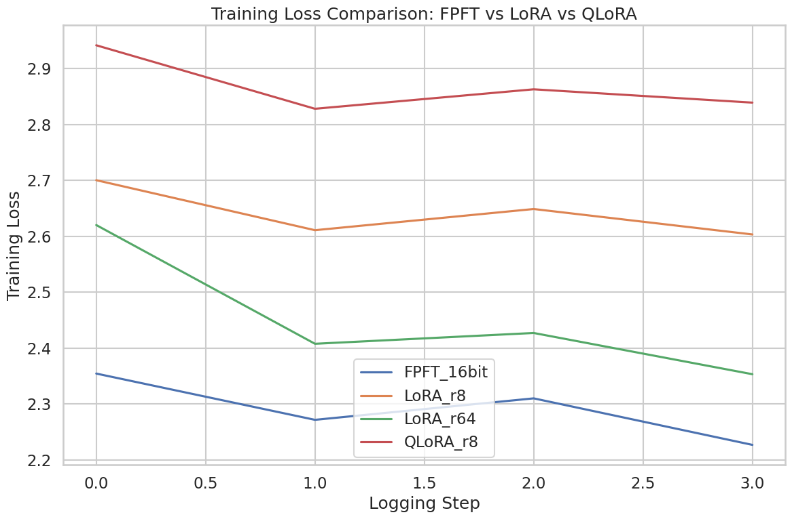
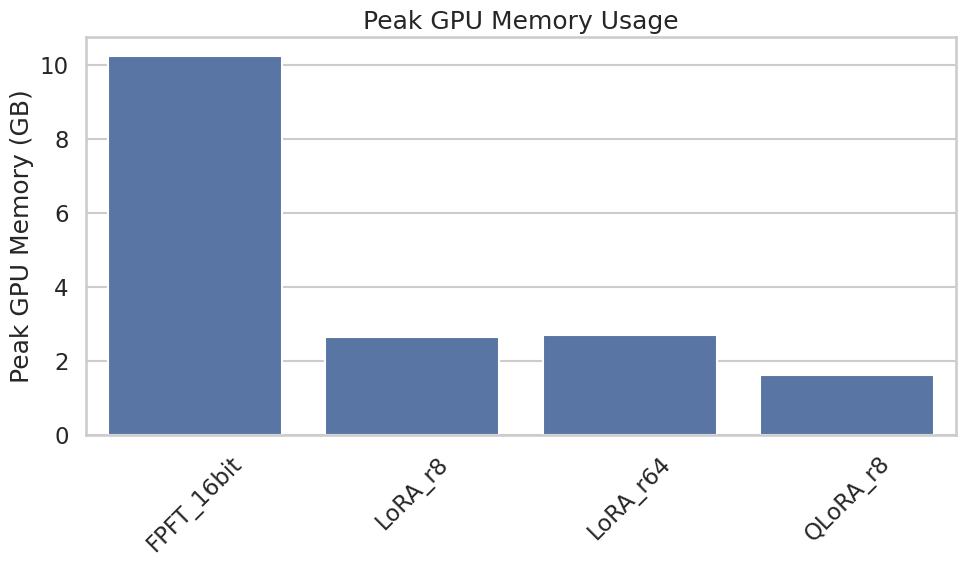
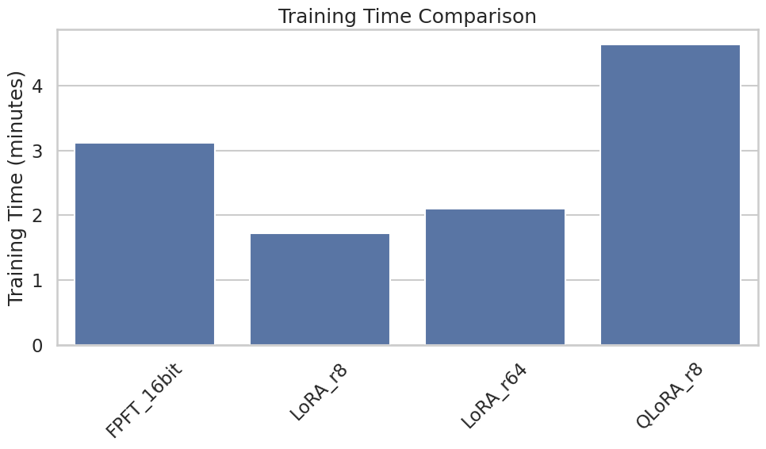

# Benchmarking Foundation Model Fine-Tuning: FPFT vs. LoRA vs. QLoRA

An empirical benchmarking study analyzing trade-offs between Full-Parameter Fine-Tuning (FPFT), Low-Rank Adaptation (LoRA), and Quantized LoRA (QLoRA) on computational efficiency and convergence.

This project explores the empirical optimization of parameter-efficient fine-tuning (PEFT) methods.

## Experimental Setup

- **Environment:** Google Colab (NVIDIA T4 GPU, 16GB VRAM)
- **Model:** `Qwen/Qwen2-0.5B`
- **Dataset:** `databricks/databricks-dolly-15k` (1,500-sample subset)
- **Task:** Causal Language Modeling / Instruction Tuning

## Experimental Runs

The same base model was fine-tuned on the same dataset with four configurations:

1. **Run A:** Full-Parameter Fine-Tuning (FPFT, 16-bit)
2. **Run B:** LoRA (rank `r=8`, alpha `16`, 16-bit)
3. **Run C:** LoRA (rank `r=64`, alpha `128`, 16-bit)
4. **Run D:** QLoRA (rank `r=8`, 4-bit NF4 quantization via `bitsandbytes`)

## Results Visualizations

## Key Findings

### 1) Memory Efficiency vs. Convergence

- **FPFT** achieved the lowest training loss (fastest convergence trend) but required the highest VRAM usage (around 10GB+).
- **LoRA** reduced peak VRAM substantially (around 2.5–2.7GB) while keeping a competitive loss curve.
- Increasing LoRA rank from **`r=8`** to **`r=64`** improved convergence trend with only a small memory increase.
- **QLoRA** produced the lowest memory footprint (around 1.5–1.6GB), making it practical for constrained hardware.

### 2) Compute Time Trade-off

- **QLoRA** was the most memory-efficient but took the longest wall-clock time in this benchmark.
- **LoRA r=8** was the fastest run, followed by **LoRA r=64**, then **FPFT**, with **QLoRA** as the slowest.
- This supports the expected overhead from repeated quantization/dequantization during training.

## Benchmark Snapshot

| Method | Trainable Params | Peak Memory (GB) | Training Time (min) | Loss Trend |
|---|---:|---:|---:|---|
| FPFT (16-bit) | 494,032,768 (100%) | ~10.2 | ~3.1 | Best |
| LoRA r=8 | 540,672 (0.1093%) | ~2.6 | ~1.7 | Moderate |
| LoRA r=64 | 4,325,376 (0.8679%) | ~2.7 | ~2.1 | Better than LoRA r=8 |
| QLoRA r=8 (4-bit) | 540,672 (0.1713% over quantized base) | ~1.6 | ~4.6 | Weakest in this run |

## Conclusion

This benchmark confirms that LoRA and QLoRA significantly reduce memory requirements for LLM fine-tuning, improving accessibility on limited hardware. The trade-off is performance: compared to FPFT, these PEFT methods may converge more slowly and/or require longer training time depending on configuration.

A practical takeaway is that **LoRA** often provides a strong middle ground between convergence quality and efficiency, while **QLoRA** is ideal when memory is the primary constraint.

## Reproducibility

The full experiment is implemented in the notebook:

- [LoRA_vs_Full_Fine_Tuning.ipynb](LoRA_vs_Full_Fine_Tuning.ipynb)

If running on Colab, execute cells top-to-bottom to reproduce all four runs and plots.
